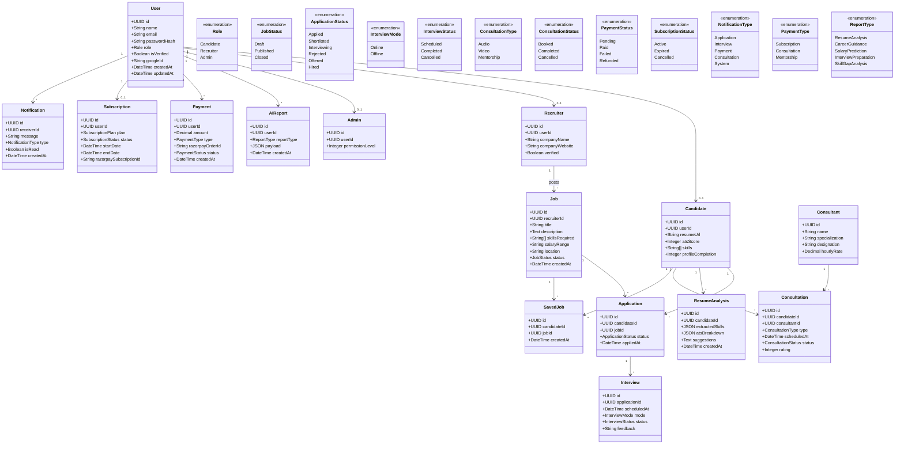
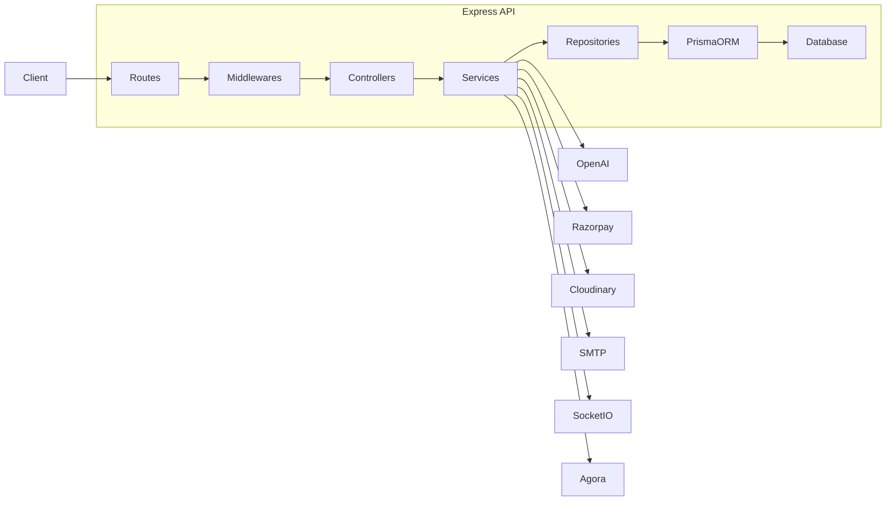
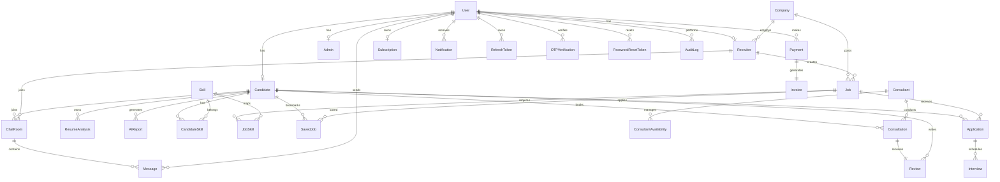

# System Design

This following section contains all the diagram and information like relationship of objects that are used to get the information about the working , implementation and Structure of the project. This includes the flows and methododlogies included in the project.

## System Architecture

```mermaid
flowchart TB

%% ==================================================
%% USERS
%% ==================================================

Guest([Guest])
Candidate([Candidate])
Recruiter([Recruiter])
Admin([Admin])

%% ==================================================
%% CLIENT LAYER
%% ==================================================

subgraph CLIENT["Presentation Layer (Next.js 15)"]

Landing[Landing Page]

CandidateDashboard[Candidate Dashboard]

RecruiterDashboard[Recruiter Dashboard]

AdminDashboard[Admin Dashboard]

SharedUI[Shared UI Components
ShadCN
Tailwind
Framer Motion]

end

Guest --> Landing
Candidate --> CandidateDashboard
Recruiter --> RecruiterDashboard
Admin --> AdminDashboard

Landing --> SharedUI
CandidateDashboard --> SharedUI
RecruiterDashboard --> SharedUI
AdminDashboard --> SharedUI

%% ==================================================
%% API GATEWAY
%% ==================================================

FrontendAPI["REST API
HTTPS
JWT"]

SharedUI --> FrontendAPI

%% ==================================================
%% BACKEND
%% ==================================================

subgraph BACKEND["Node.js + Express Backend"]

AuthService

CandidateService

RecruiterService

JobService

ApplicationService

InterviewService

AIService

ConsultationService

PaymentService

NotificationService

AdminService

SocketServer["Socket.io Server"]

end

FrontendAPI --> AuthService
FrontendAPI --> CandidateService
FrontendAPI --> RecruiterService
FrontendAPI --> JobService
FrontendAPI --> ApplicationService
FrontendAPI --> InterviewService
FrontendAPI --> AIService
FrontendAPI --> ConsultationService
FrontendAPI --> PaymentService
FrontendAPI --> NotificationService
FrontendAPI --> AdminService

NotificationService --> SocketServer

%% ==================================================
%% DATABASE
%% ==================================================

subgraph DATABASE

Postgres[(PostgreSQL)]

Prisma["Prisma ORM"]

end

AuthService --> Prisma
CandidateService --> Prisma
RecruiterService --> Prisma
JobService --> Prisma
ApplicationService --> Prisma
InterviewService --> Prisma
ConsultationService --> Prisma
PaymentService --> Prisma
NotificationService --> Prisma
AdminService --> Prisma

Prisma --> Postgres

%% ==================================================
%% THIRD PARTY SERVICES
%% ==================================================

subgraph External

OpenAI

Cloudinary

GoogleOAuth

Razorpay

SMTP

Agora

end

AuthService --> GoogleOAuth
AuthService --> SMTP

CandidateService --> Cloudinary

AIService --> OpenAI

PaymentService --> Razorpay

ConsultationService --> Agora

NotificationService --> SMTP
```



## UML Diagram



## Internal Backend Structure



<br>
<br>
<br>

---

---

<br>
<br>
<br>

# Database Design

This section of the file contains the Database related

## Database Tables

```
Authentication
│
├── User
├── Candidate
├── Recruiter
├── Admin
├── RefreshToken
├── OTPVerification
└── PasswordResetToken


Company
│
├── Company
└── CompanyDocument


Jobs
│
├── Job
├── JobSkill
├── SavedJob
├── Application
└── Interview


AI
│
├── ResumeAnalysis
├── AIReport
├── Skill
├── CandidateSkill
└── JobRecommendation


Consultation
│
├── Consultant
├── ConsultantAvailability
├── Consultation
└── Review


Payments
│
├── Payment
├── Invoice
├── Subscription
└── Coupon


Communication
│
├── Notification
├── ChatRoom
├── Message
└── Attachment


Administration
│
├── AuditLog
├── ActivityLog
└── SystemSettings
```

## Tables Schema

**Users:** `id `_(PK)_ , `name` , `email `_(Unique)_ , `phone` , `passwordHash` , `role` , `googleId` , `avatar` , `isVerified` , `status` , `lastLogin` , `createdAt` , `updatedAt` , `deletedAt`.

**Candidate:** `id` , `userId `_(FK)_, `headline`, `bio`, `resumeUrl`, `ATSScore`, `profileCompletion`, `experienceYears`,`preferredRole`, `preferredLocation`, `expectedSalary`, `createdAt`

**Recruiter:** `id` , `userId` _(FK)_, `companyId` _(FK)_, `designation`, `verified`, `createdAt`

**Company:** `id`, `name`, `website`, `industry`, `description`, `logo`, `employeeCount`, `headquarters`, `verified`

**Job:** `id`, `companyId` _(FK)_, `recruiterId` _(FK)_, `title`, `description`, `salaryMin`, `salaryMax`, `employmentType`, `experienceLevel`, `location`, `status`, `deadline`, `createdAt`, `updatedAt`

**Application**: `id`, `jobId` _(FK)_, `candidateId` _(FK)_, `status`, `resumeVersion`, `coverLetter`, `appliedAt`, `updatedAt`

**Interview:** `id`, `applicationId` _(FK)_, `mode`, `meetingLink`, `scheduledAt`, `status`, `feedback`, `rating`, `createdAt`, `updatedAt`

**ResumeAnalysis:** `id`, `candidateId` _(FK)_, `resumeUrl`, `ATSScore`, `extractedSkills`, `ATSBreakdown`, `suggestions`, `createdAt`

**AIReport:** `id`, `candidateId` _(FK)_, `reportType`, `payload`, `tokensUsed`, `cost`, `createdAt`

**Skill:** `id`, `name`, `category`, `createdAt`

**CandidateSkill:** `id`, `candidateId` _(FK)_, `skillId` _(FK)_, `level`, `experienceYears`

**JobSkill:** `id`, `jobId` _(FK)_, `skillId` _(FK)_, `importance`

**SavedJob:** `id`, `candidateId` _(FK)_, `jobId` _(FK)_, `createdAt`

**Consultant:** `id`, `name`, `email`, `phone`, `specialization`, `bio`, `experienceYears`, `hourlyRate`, `profileImage`, `rating`, `createdAt`

**ConsultantAvailability:** `id`, `consultantId` _(FK)_, `day`, `startTime`, `endTime`, `isBooked`

**Consultation:** `id`, `candidateId` _(FK)_, `consultantId` _(FK)_, `paymentId` _(FK)_, `type`, `scheduledAt`, `meetingLink`, `status`, `createdAt`

**Review:** `id`, `consultationId` _(FK)_, `candidateId` _(FK)_, `rating`, `comment`, `createdAt`

**Payment:** `id`, `userId` _(FK)_, `amount`, `currency`, `paymentType`, `status`, `razorpayOrderId`, `razorpayPaymentId`, `createdAt`

**Invoice:** `id`, `paymentId` _(FK)_, `invoiceNumber`, `GST`, `pdfUrl`, `createdAt`

**Subscription:** `id`, `userId` _(FK)_, `plan`, `status`, `startDate`, `endDate`, `razorpaySubscriptionId`, `createdAt`

**Notification:** `id`, `userId` _(FK)_, `title`, `message`, `type`, `isRead`, `createdAt`

**ChatRoom:** `id`, `candidateId` _(FK)_, `recruiterId` _(FK)_, `createdAt`

**Message:** `id`, `chatRoomId` _(FK)_, `senderId` _(FK)_, `message`, `attachmentUrl`, `isSeen`, `createdAt`

**RefreshToken:** `id`, `userId` _(FK)_, `token`, `expiresAt`, `revoked`, `createdAt`

**OTPVerification:** `id`, `userId` _(FK)_, `otp`, `purpose`, `expiresAt`, `verified`, `createdAt`

**PasswordResetToken:** `id`, `userId` _(FK)_, `token`, `expiresAt`, `createdAt`

**AuditLog:** `id`, `userId` _(FK)_, `action`, `module`, `oldValue`, `newValue`, `ipAddress`, `createdAt`

## ER Diagram


